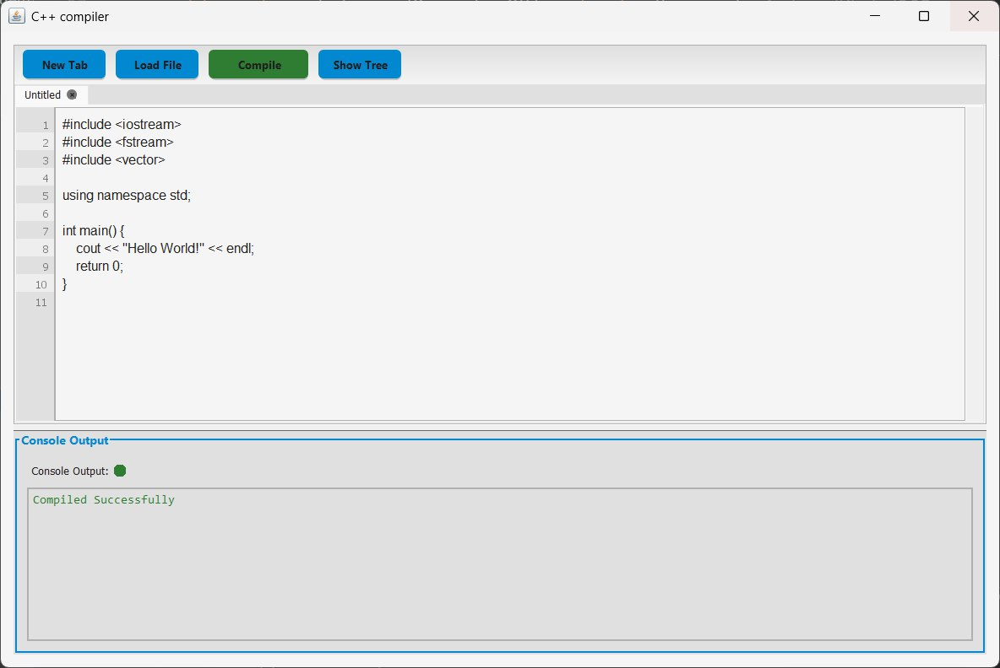
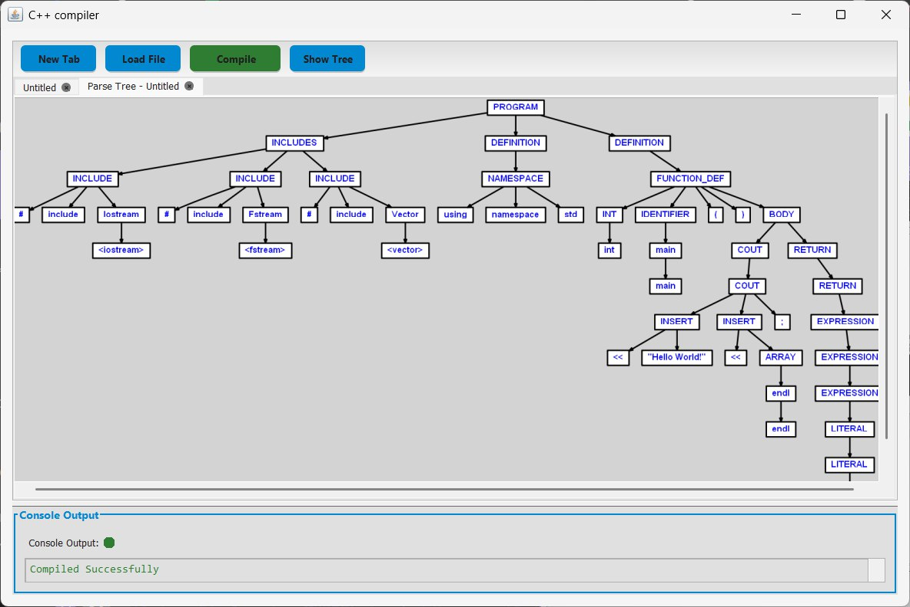

<h1>🛠️ C++ Compiler Project</h1>

  This project is a simple C++ compiler built using 
  <strong>ANTLR3</strong> and the <strong>Graphviz 2.38</strong> Java library.
  It takes a <code>.txt</code> file containing C++ code as input, or allows you to write code in a built-in text field,
  parses it, and generates its corresponding Abstract Syntax Tree (AST) graphically.

<h2>📌 Features</h2>
<ul>
  <li>Parses C++ source code written in a <code>.txt</code> file or typed into a built-in code editor</li>
  <li>Uses <strong>ANTLR v3</strong> for lexical and syntactic analysis</li>
  <li>Generates graphical representation of the syntax tree using <strong>Graphviz</strong></li>
  <li>Interactive GUI interface for file input or manual code entry</li>
  <li>Written in Java</li>
</ul>

<h2>🚀 How to Run</h2>
<ol>
  <li>Make sure you have Java and Graphviz 2.38 installed.</li>
  <li>Clone the repository: <code>git clone https://github.com/ahmedKhaled365/Compiler.git</code></li>
  <li>Compile the Java files using your preferred method or an IDE like IntelliJ or Eclipse.</li>
  <li>Run the main class and either provide a path to your C++ <code>.txt</code> file or enter code in the GUI.</li>
</ol>

<h2>💻 Example Input</h2>

  

  You can either choose a file containing C++ code or write it directly into the built-in text field provided in the GUI.

<h2>🖼️ Example Output</h2>

  

<h2>📄 License</h2>

This project is licensed under the MIT License.

